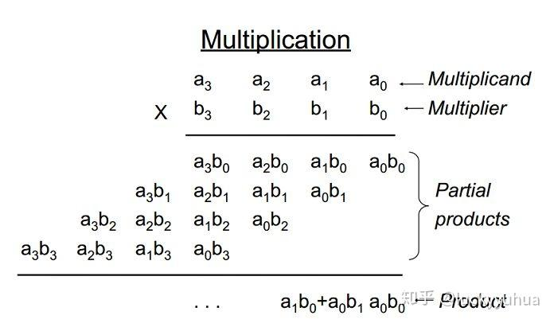
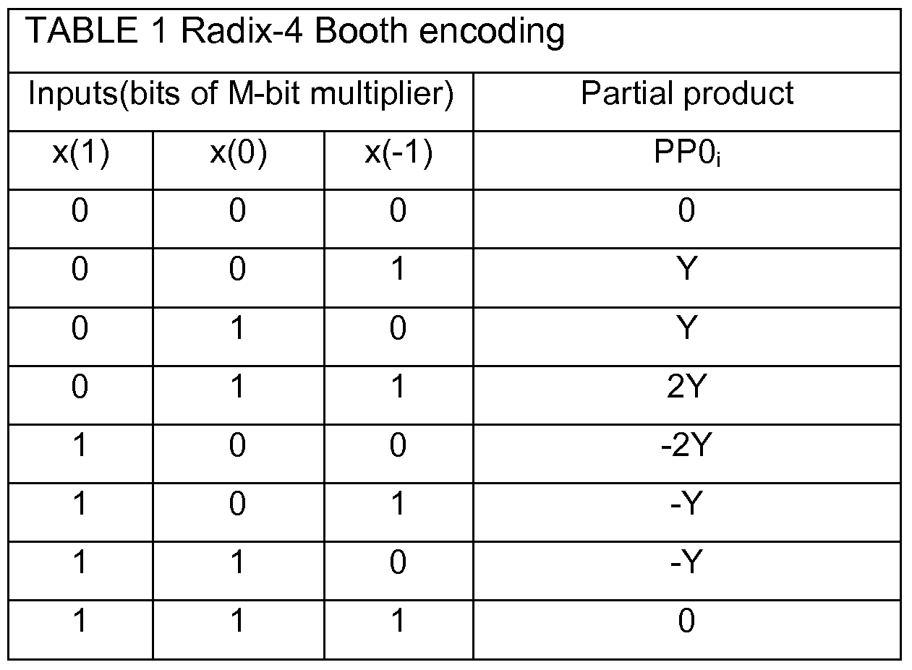
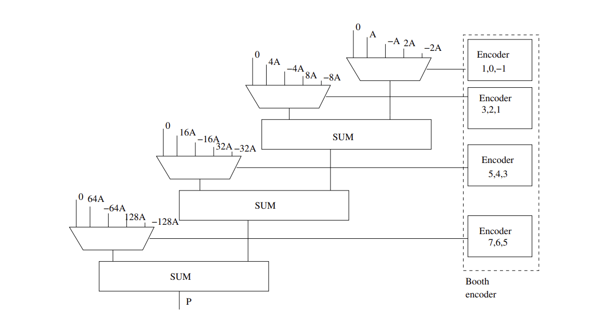
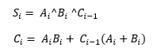
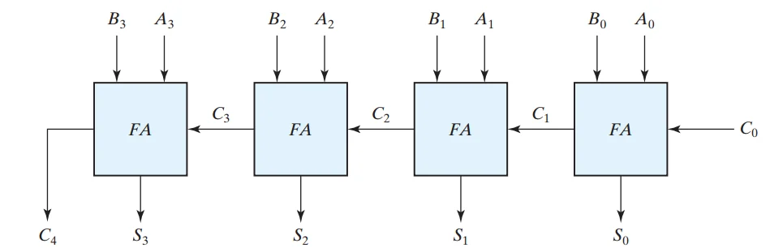
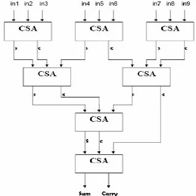
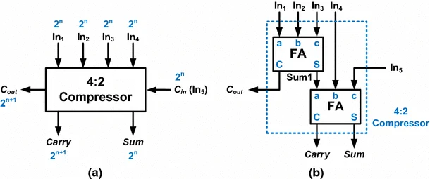

# Radix-4 Booth - Wallace Tree Multiplier

Questo repository contiene l'implementazione hardware (RTL) di un moltiplicatore ad alte prestazioni. Il design si basa su due tecniche fondamentali per l'ottimizzazione dell'area e della latenza: la codifica **Modified Booth (Radix-4)** per la riduzione dei prodotti parziali e l'albero di **Wallace** per la loro compressione parallela.

---

## 1. Il problema della Moltiplicazione Standard

Nella moltiplicazione binaria tradizionale, il numero di prodotti parziali generati è esattamente uguale al numero di bit del moltiplicatore. 

*(Rappresentazione della generazione dei prodotti parziali in una moltiplicazione standard)*

Come mostrato nell'immagine, per ogni bit del moltiplicatore viene generato un prodotto parziale (che può essere il moltiplicando stesso o zero). Il problema principale nella progettazione hardware è che il numero di sommatori necessari dipende direttamente dal numero di prodotti parziali. Pertanto, sommare $N$ prodotti parziali in cascata introduce un notevole ritardo critico (critical path) e consuma molta area sul silicio.

---

## 2. Da Booth alla codifica "Modified Booth" (Radix-4)

### La Trasformata di Booth originale
La trasformata di Booth sfrutta una proprietà matematica dei numeri binari: sequenze di 1 consecutivi possono essere riscritte come una sottrazione. Ad esempio: 

**01111110 = 10000000 - 10**

Maggiore è il numero di 1 consecutivi, migliore è la semplificazione. Tuttavia, questa trasformazione di base non ottimizza realmente il circuito hardware. Il numero effettivo di addizionatori necessari rimane invariato rispetto al numero di bit del moltiplicatore originale, poiché la struttura dell'hardware deve essere dimensionata per il caso peggiore.

### Il Metodo di codifica Booth Migliorato (Radix-4)
Per ridurre *fisicamente* il numero di prodotti parziali e quindi il numero di accumulatori, si utilizza il **Modified Booth Encoding** (Radix-4).

Il numero binario del moltiplicatore $X$ viene raggruppato in gruppi di 3 bit partendo dal bit meno significativo (LSB). Regole di raggruppamento:
* Il bit meno significativo del primo gruppo viene integrato con un bit fittizio $x_{-1}$ impostato a **0**.
* I gruppi adiacenti si sovrappongono di un bit (il bit più significativo del gruppo precedente diventa il bit meno significativo del gruppo successivo).

Questo metodo **dimezza** il numero di prodotti parziali. Ad esempio, in una moltiplicazione a 32 bit, anziché generare 32 prodotti parziali da sommare, se ne generano solo 16 (o 17 nel caso di numeri senza segno compatibili). 

---

## 3. Generazione dei Prodotti Parziali

La relazione tra ogni gruppo di 3 bit consecutivi determina l'operazione da eseguire sul moltiplicando $Y$. Siano $x_{2i+1}$, $x_{2i}$ e $x_{2i-1}$ i tre bit consecutivi del moltiplicatore $X$, e sia $PP_i$ il prodotto parziale generato all'i-esimo passo. 

La seguente tabella di verità mostra le operazioni necessarie:

*(Tabella di look-up per la codifica Booth Radix-4)*

Basandosi su queste combinazioni, il prodotto parziale può assumere solo 5 valori possibili: **0**, **$Y$**, **$2Y$**, **$-Y$**, **$-2Y$**.

**Vantaggi hardware di questa implementazione:**
* **$Y$ e $0$**: Passaggio diretto o azzeramento.
* **$2Y$**: In binario, la moltiplicazione per 2 si ottiene a costo zero hardware con un semplice **shift a sinistra di 1 bit** (left shift).
* **Valori negativi ($-Y$, $-2Y$)**: Si ottengono calcolando il complemento a due (inversione dei bit + somma di 1 nel LSB dell'addizionatore successivo).

Il tipo più elementare di codifica Booth migliorata è proprio questa base 4, poiché non richiede alcun addizionatore extra per generare i prodotti parziali (cosa che invece avverrebbe in un Booth di ordine superiore per generare, ad esempio, un multiplo come $3Y$). Questo la rende la scelta ottimale per bilanciare la riduzione dei prodotti parziali e la semplicità del circuito generatore.

---

## 4. L'Albero di Wallace (Wallace Tree Compression)

La codifica Booth affronta il primo aspetto dell'ottimizzazione: ridurre il numero di prodotti parziali. Tuttavia, il ritardo di propagazione del riporto (carry propagation delay) degli accumulatori incide ancora significativamente sulle prestazioni. Qui vediamo lo schema utilizzando semplici adder per le somme parziali:

*(Multiplier Booth Radix-4 with RCA)*

Se si utilizza la somma diretta, il risultato del bit corrente dipende dal riporto del bit precedente. Questo rende l'intero processo seriale e, maggiore è la larghezza del bus, maggiore sarà il ritardo. La chiave per l'ottimizzazione è **eliminare le catene di riporto e parallelizzare l'operazione**.

### Il Sommatore Carry-Save (CSA)

La tecnica standard per l'accumulazione parallela è l'utilizzo di sommatori **Carry-Save (CSA)**. A livello logico, un CSA è essenzialmente un *Full Adder* (sommatore completo) a 1 bit, le cui equazioni logiche sono:

$$S_i = A_i \oplus B_i \oplus C_{i-1}$$
$$C_i = A_i B_i + C_{i-1}(A_i + B_i)$$

Il vero vantaggio del CSA non risiede nella logica interna, ma in come viene interconnesso nel circuito. Per capirlo, supponiamo di dover sommare tre numeri a 4 bit: $A[3:0]$, $B[3:0]$ e $C[3:0]$.

#### Approccio Seriale (Inefficiente)
Nell'addizione tradizionale a propagazione di riporto (Ripple Carry), l'addizione del primo livello presenta un ritardo causato dalla catena dei riporti. 

*(Catena di riporto in un sommatore seriale: il ritardo cresce linearmente con il numero di bit)*

#### Approccio Carry-Save / Compressione 3-2 (Efficiente)
Utilizzando lo stesso hardware del CSA, possiamo riorganizzare l'architettura. Invece di propagare il riporto orizzontalmente allo stadio adiacente, il CSA accetta tre bit della stessa colonna in ingresso e genera due bit in uscita (una *Sum* e un *Carry* per la colonna successiva).

*(Architettura Carry-Save: esecuzione parallela senza catena di riporto orizzontale)*

Come mostrato nello schema, il primo stadio dei quattro CSA è **completamente parallelo**. Consuma un solo ritardo logico (gate delay) che *non aumenta* con la larghezza dei bit. Poiché questo blocco accetta tre ingressi e genera due uscite, è noto nella letteratura RTL come **Compressore 3-2** (3-2 compressor).

### Architettura dell'Albero e Compressori Avanzati

Applicato al nostro moltiplicatore, il metodo Carry-Save viene utilizzato per raggruppare i prodotti parziali generati da Booth in insiemi di tre. Le uscite (vettori di Somma e Riporto) di ogni stadio vengono a loro volta compresse a cascata, formando una struttura ad albero: l'**Albero di Wallace** (Wallace Tree).

*(Implementazione a livello di porte logiche di un Compressore 4-2)*

Nei moltiplicatori industriali ad alte prestazioni, per bilanciare meglio i percorsi dei segnali e ridurre ulteriormente gli stadi dell'albero, si utilizzano spesso anche **Compressori 4-2**. Questi blocchi accettano quattro prodotti parziali in ingresso e restituiscono due uscite, gestendo i riporti intermedi internamente in modo ottimizzato.

### Lo Stadio Finale (Final Addition)
Il processo di compressione nell'Albero di Wallace continua in modo puramente combinatorio e parallelo finché non si raggiungono esattamente **due righe finali** (un vettore *Sum* e un vettore *Carry*). 

Poiché la compressione di Wallace non può ridurre 2 righe in 1 singola riga senza propagare i riporti, queste due ultime righe vengono sommate utilizzando un tradizionale ma velocissimo **Sommatore a Propagazione Veloce** (es. *Carry Look-Ahead Adder* o *Kogge-Stone Adder*) per ottenere il prodotto finale a 64 bit.
